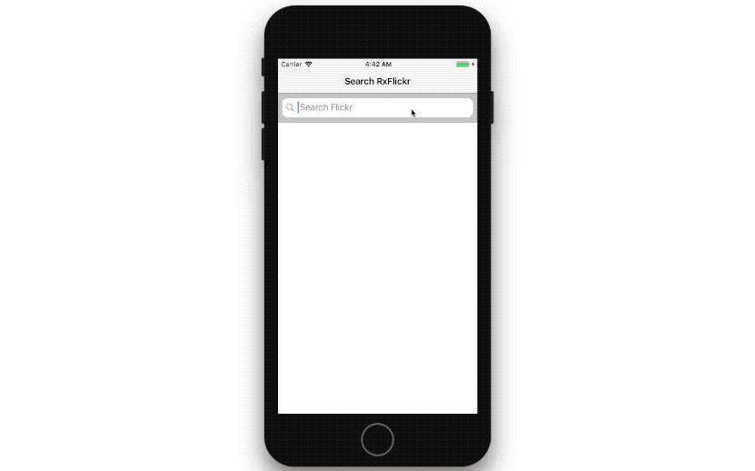

# Rx Flickr
This project is about iOS with RxSwift, ReactorKit.

All code is Using API [Flickr](www.flickr.com)

 

## View
---

 

## Libraries
- ### Architecutre

  ---

  - [RxSwift](https://github.com/ReactiveX/RxSwift)
  - [ReactorKit](https://github.com/ReactorKit/ReactorKit)
  - [RxOptional](https://github.com/RxSwiftCommunity/RxOptional)

- ### UI

  ---

- ### Networking

  ---

  - [Alamofire](https://github.com/Alamofire/Alamofire)
  - [Kingfisher](https://github.com/onevcat/Kingfisher)

- ### Parsing
  ---

  - [SwiftyJSON](https://github.com/SwiftyJSON/SwiftyJSON)
  - [ObjectMapper](https://github.com/Hearst-DD/ObjectMapper)

- ### Misc.
  ---
  
- ### Feature.
---
- New MVI (Model-View-Intent) pattern
- search images using flickr API
- display images in collectionView (Asyncronous loading)
- paginated scrolling (endless scrolling)
- detail picture page

- ### Feature can be updated (Due to time constrant and not included in requirement).
---
- search history
- save images to disk
- share image to social network
- create collection of favorite images

 
 
 
